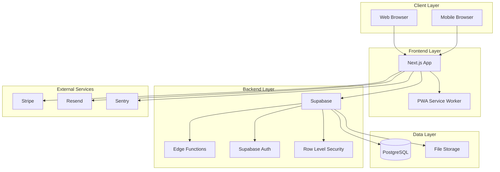
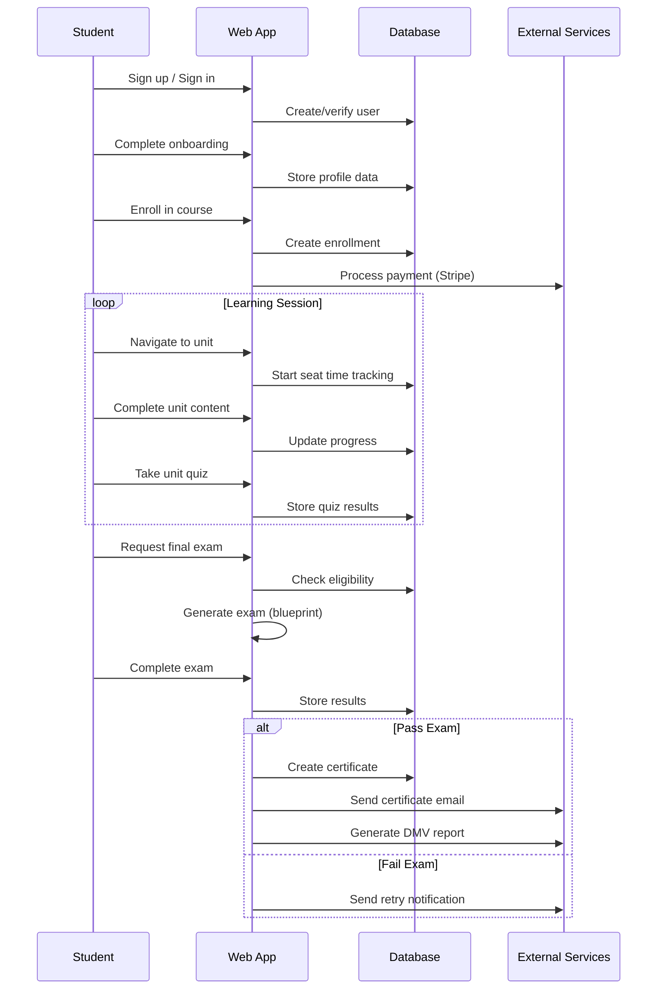
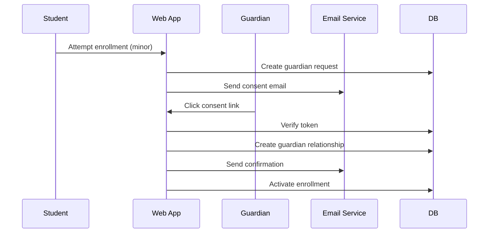

# System Architecture

**Purpose & Outcome**  
This document provides a high-level overview of the Permit School system architecture, including the monorepo structure, technology stack, data flows, and key system components.

## Monorepo Structure

```
permit-school/
├── web/                    # Next.js 15 application
│   ├── src/app/           # App Router pages and API routes
│   ├── src/components/    # Reusable UI components
│   ├── src/lib/          # Utility functions and services
│   ├── tests/e2e/        # Playwright E2E tests
│   └── package.json      # Web app dependencies
├── supabase/              # Database and backend services
│   ├── migrations/       # PostgreSQL schema migrations
│   ├── functions/        # Edge Functions (tutor, etc.)
│   └── config.toml      # Supabase configuration
├── ops/                   # Operational tooling
│   ├── seed/            # Data seeding scripts
│   ├── checks/          # Health checks and validation
│   └── scripts/         # Operational scripts
├── tools/                 # Development and utility tools
│   ├── env/             # Environment management
│   ├── docs/            # Documentation tooling
│   └── ingest/          # Content ingestion tools
├── docs/                  # Documentation
├── scripts/               # Root-level scripts
└── package.json          # Root dependencies
```

## Technology Stack

### Frontend
- **Next.js 15** - React framework with App Router
- **Material-UI (MUI) 6** - Component library and design system
- **TypeScript** - Type-safe JavaScript
- **next-intl** - Internationalization (EN/ES)
- **SWR** - Data fetching and caching
- **PWA** - Progressive Web App capabilities

### Backend
- **Supabase** - PostgreSQL database with RLS
- **Supabase Auth** - Authentication and authorization
- **Edge Functions** - Serverless functions (tutor, etc.)
- **PostgreSQL** - Primary database with advanced features

### External Services
- **Stripe** - Payment processing and subscriptions
- **Resend** - Email delivery service
- **Sentry** - Error monitoring and performance
- **Vercel** - Hosting and deployment

### Development & Testing
- **Vitest** - Unit testing framework
- **Playwright** - End-to-end testing
- **ESLint** - Code linting with accessibility rules
- **Lighthouse CI** - Performance and accessibility monitoring

## System Architecture Diagram



## Key System Components

### 1. Authentication & Authorization

**Supabase Auth** handles user authentication with:
- Email/password authentication
- Google One Tap integration
- Session management
- Role-based access control (student, guardian, admin)

**Row Level Security (RLS)** enforces data access policies:
- Users can only access their own data
- Guardians can access linked student data
- Admins have elevated access for management

### 2. Learning Management System

**Core Learning Flow**:
1. **Enrollment** - Course registration with guardian consent for minors
2. **Seat Time Tracking** - Real-time progress monitoring
3. **Unit Navigation** - Structured learning path through curriculum
4. **Quiz Completion** - Knowledge assessment with immediate feedback
5. **Final Exam** - Comprehensive assessment with configurable requirements

**Key Features**:
- Real-time seat time tracking with idle detection
- Adaptive quiz system with immediate feedback
- Progress persistence across sessions
- Offline capability with sync

### 3. Assessment & Certification

**Exam System**:
- Blueprint-based exam generation
- Configurable requirements per jurisdiction
- Secure exam environment
- Automated scoring and feedback

**Certificate Management**:
- Digital certificate generation
- Public verification system
- Physical fulfillment workflow
- Regulatory compliance tracking

### 4. Billing & Subscriptions

**Stripe Integration**:
- Subscription management
- Usage-based billing
- Automated dunning
- Payment portal integration

**Billing Lifecycle**:
1. Trial period with reminders
2. Subscription activation
3. Usage tracking and billing
4. Dunning management for past-due accounts

### 5. Regulatory Compliance

**DMV Reporting**:
- Automated report generation
- Tamper-evident submissions
- Audit trail maintenance
- Multi-jurisdiction support

**Data Management**:
- PII handling and retention
- Data subject access requests (DSAR)
- Automated data deletion
- Compliance monitoring

## Data Flows

### Student Journey



### Guardian Consent Flow



## Security Architecture

### Authentication Security
- **Multi-factor authentication** for admin accounts
- **Session management** with secure tokens
- **Rate limiting** on authentication endpoints
- **Account lockout** for failed attempts

### Data Security
- **Row Level Security (RLS)** on all tables
- **Encryption at rest** for sensitive data
- **Encryption in transit** (HTTPS/TLS)
- **Audit logging** for all data access

### Application Security
- **Input validation** and sanitization
- **CSRF protection** on all forms
- **Content Security Policy (CSP)** headers
- **Regular security updates** and dependency scanning

## Performance Architecture

### Frontend Performance
- **Static generation** for public pages
- **Dynamic imports** for code splitting
- **Image optimization** with Next.js
- **Service worker** for offline capability

### Backend Performance
- **Database indexing** for query optimization
- **Connection pooling** for database efficiency
- **Caching strategies** for frequently accessed data
- **CDN integration** for static assets

### Monitoring & Observability
- **Sentry** for error tracking and performance monitoring
- **Custom metrics** for business KPIs
- **Health checks** for all services
- **Log aggregation** for debugging

## Scalability Considerations

### Horizontal Scaling
- **Stateless application** design
- **Database read replicas** for read-heavy workloads
- **Edge function** distribution for global performance
- **CDN** for static content delivery

### Vertical Scaling
- **Database optimization** with proper indexing
- **Query optimization** and monitoring
- **Resource monitoring** and alerting
- **Capacity planning** based on usage patterns

## Disaster Recovery

### Backup Strategy
- **Automated database backups** (daily)
- **Point-in-time recovery** capability
- **Cross-region backup** storage
- **Regular backup testing** and validation

### Recovery Procedures
- **Documented recovery runbooks**
- **Automated recovery scripts**
- **Regular disaster recovery drills**
- **Monitoring and alerting** for system health

## Compliance & Governance

### Regulatory Compliance
- **DMV reporting** automation and validation
- **Data retention** policies and enforcement
- **Audit trail** maintenance
- **Privacy policy** compliance

### Data Governance
- **Data classification** and handling
- **Access control** and monitoring
- **Data lifecycle** management
- **Incident response** procedures

---

**Next**: [Web Architecture](WEB_ARCHITECTURE.md) - Detailed frontend architecture and component design
