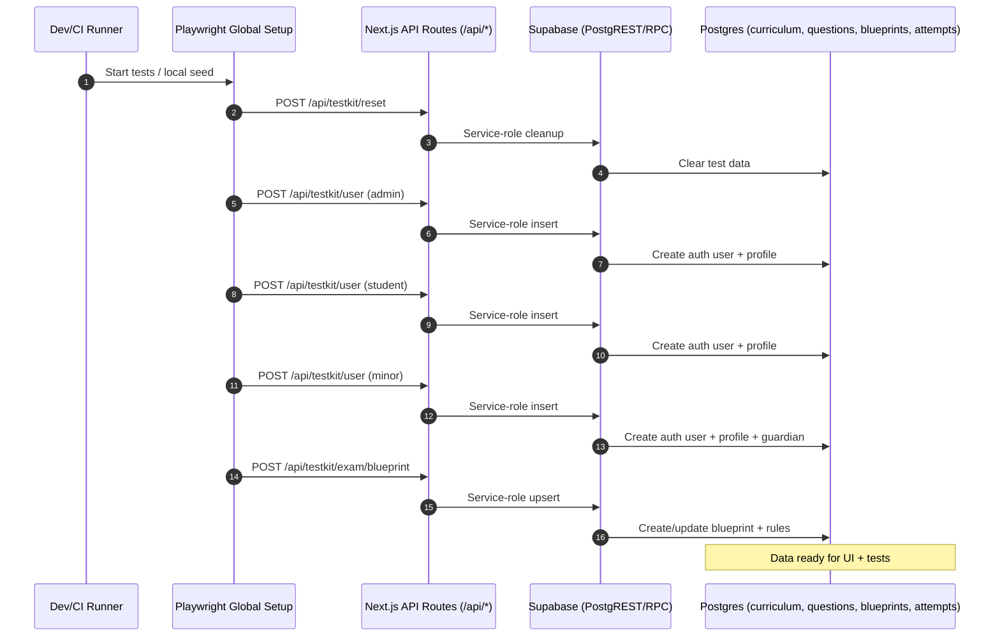

# Curriculum and Exam Seeding Documentation

## Executive Summary

The permit-school project seeds **course curriculum** and **exam tests/question banks** through a multi-layered approach:

### What Gets Seeded

- **Courses**: Jurisdiction-specific driver education courses (e.g., CA DE-ONLINE)
- **Course Units**: Individual lessons with titles, time requirements, and objectives
- **Question Bank**: Questions with skills, difficulty levels, tags, and explanations
- **Exam Blueprints**: Templates that define exam structure and question selection rules
- **Test Data**: Users, enrollments, entitlements, and exam attempts for testing

### Where Truth Lives

- **Schema**: `supabase/migrations/0000_initial_schema.sql` (core tables)
- **Curriculum**: `supabase/migrations/0002_curriculum_admin.sql` (units, chunks)
- **Questions**: `supabase/migrations/0007_question_bank_admin.sql` (question bank, blueprints)
- **Seeding**: `web/src/app/api/testkit/*` (test data creation)
- **Admin**: `web/src/app/api/admin/*` (curriculum/question management)

## System Diagram



## Tables & Relationships

### Core Curriculum Tables

- **`courses`**: Jurisdiction-specific driver education courses
  - FK: `jurisdiction_id` → `jurisdictions(id)`
  - Unique: `(jurisdiction_id, code)`
- **`course_units`**: Individual lessons within courses
  - FK: `course_id` → `courses(id)` CASCADE
  - Unique: `(course_id, unit_no)`
  - Constraints: `minutes_required` 5-240, `unit_no > 0`
- **`unit_chunks`**: Content chunks mapped to units
  - FK: `unit_id` → `course_units(id)` CASCADE
  - FK: `chunk_id` → `content_chunks(id)` CASCADE
  - PK: `(unit_id, ord)`

### Question & Exam Tables

- **`question_bank`**: Questions with skills, difficulty, tags
  - FK: `course_id` → `courses(id)` CASCADE
  - FK: `author_id` → `auth.users(id)`
  - FK: `reviewer_id` → `auth.users(id)`
  - Constraints: `difficulty` 1-5, `status` in ('draft', 'approved', 'archived')
- **`exam_blueprints`**: Exam templates
  - FK: `course_id` → `courses(id)` CASCADE
  - Unique: `(course_id)` WHERE `is_active = true`
- **`exam_blueprint_rules`**: Question selection rules
  - FK: `blueprint_id` → `exam_blueprints(id)` CASCADE
  - PK: `(blueprint_id, rule_no)`
  - Constraints: `difficulty` 1-5, `count > 0`

### Test & Progress Tables

- **`attempts`**: Quiz/mock/final exam attempts
  - FK: `student_id` → `auth.users(id)` CASCADE
  - FK: `course_id` → `courses(id)`
- **`attempt_items`**: Individual questions in attempts
  - FK: `attempt_id` → `attempts(id)` CASCADE
  - PK: `(attempt_id, item_no)`
- **`enrollments`**: Student course enrollments
  - FK: `user_id` → `auth.users(id)` CASCADE
  - FK: `course_id` → `courses(id)`
- **`entitlements`**: Course access permissions
  - FK: `user_id` → `auth.users(id)` CASCADE

## Codepath Deep-Dive

### 1. Admin Curriculum Management

#### Course Management

- **Endpoint**: `GET /api/admin/curriculum/courses`
- **Handler**: `web/src/app/api/admin/curriculum/courses/route.ts`
- **Auth**: Requires admin role via `profiles.role = 'admin'`
- **Client**: `getServerClient()` (user session)
- **Query**: Joins `courses` with `jurisdictions` for display

#### Unit Management

- **Endpoint**: `GET /api/admin/curriculum/units`
- **Handler**: `web/src/app/api/admin/curriculum/units/route.ts`
- **Auth**: Requires admin role
- **Client**: `getServerClient()` (user session)
- **Query**: Filters by course, orders by `unit_no`

### 2. Question Bank Management

#### Question CRUD

- **Endpoint**: `POST /api/admin/questions/upsert`
- **Handler**: `web/src/app/api/admin/questions/upsert/route.ts`
- **Auth**: Requires admin role + Bearer token
- **Client**: `getSupabaseAdmin()` (service role)
- **Features**:
  - Version bumping on core field changes
  - Tag normalization (lowercase)
  - Status transitions with `published_at` tracking
  - Idempotent updates

#### Question Listing

- **Endpoint**: `GET /api/admin/questions/list`
- **Handler**: `web/src/app/api/admin/questions/list/route.ts`
- **Auth**: Requires admin role
- **Client**: `getServerClient()` (user session)
- **Features**: Filtering by course, status, tags, skills

### 3. Exam Blueprint Creation

#### Testkit Blueprint

- **Endpoint**: `POST /api/testkit/exam/blueprint`
- **Handler**: `web/src/app/api/testkit/exam/blueprint/route.ts`
- **Auth**: `TESTKIT_TOKEN` Bearer token
- **Client**: `getSupabaseAdmin()` (service role)
- **Process**:
  1. Lookup course by `j_code` + `course_code`
  2. Get default question count from `jurisdiction_configs.final_exam_num_questions`
  3. Check for existing active blueprint
  4. Create/update blueprint with simple "General" skill rule
  5. Insert rule covering all difficulty levels (1-5)

#### Blueprint Rules

- **Table**: `exam_blueprint_rules`
- **Structure**: One rule per skill with count, difficulty range, tags
- **Default**: Single "General" rule covering all questions
- **Selection**: Questions matched by skill, difficulty, tags

### 4. E2E Testkit Seeding

#### Global Setup Flow

- **File**: `web/tests/e2e/global-setup.ts`
- **Trigger**: Playwright global setup (non-CI only)
- **Environment**: Requires `TESTKIT_ON=true`

#### User Creation

- **Endpoint**: `POST /api/testkit/user`
- **Handler**: `web/src/app/api/testkit/user/route.ts`
- **Process**:
  1. Generate unique email: `test-${timestamp}@permit-school.test`
  2. Create auth user with `supabase.auth.admin.createUser()`
  3. Insert `student_profiles` record
  4. Set admin role if requested
  5. Create consent records (terms, privacy)

#### Enrollment

- **Endpoint**: `POST /api/testkit/enroll`
- **Handler**: `web/src/app/api/testkit/enroll/route.ts`
- **Process**:
  1. Lookup course by `j_code` + `course_code`
  2. Check for existing enrollment
  3. Create/update enrollment with `status: 'active'`

#### Testkit API Class

- **File**: `web/tests/e2e/utils/testkit.ts`
- **Methods**:
  - `createUser(options)`: Create test users
  - `enrollUser(userId, jCode, courseCode)`: Enroll in course
  - `addSeatTime(userId, jCode, courseCode, totalMs)`: Add progress
  - `setEntitlement(userId, jCode, active)`: Set course access
  - `ensureExamBlueprint(jCode, courseCode, numQuestions)`: Create blueprint

## Exact Commands to Seed Locally

### 1. Supabase Setup

```bash
# Start Supabase
supabase start

# Reset database (optional - drops + migrates)
supabase db reset

# Verify migrations applied
supabase db diff
```

### 2. Environment Variables

```bash
# Required for testkit seeding
export TESTKIT_ON=true
export TESTKIT_TOKEN=dev-super-secret

# Supabase connection
export NEXT_PUBLIC_SUPABASE_URL=http://127.0.0.1:54321
export NEXT_PUBLIC_SUPABASE_ANON_KEY=eyJhbGciOiJIUzI1NiIsInR5cCI6IkpXVCJ9...
export SUPABASE_SERVICE_ROLE_KEY=eyJhbGciOiJIUzI1NiIsInR5cCI6IkpXVCJ9...

# App configuration
export BASE_URL=http://localhost:3000
```

### 3. Start Web Application

```bash
cd web
npm install
npm run dev
```

### 4. Seed via Testkit Endpoints

```bash
# Create admin user
curl -X POST http://localhost:3000/api/testkit/user \
  -H "Authorization: Bearer dev-super-secret" \
  -H "Content-Type: application/json" \
  -d '{"admin": true, "locale": "en"}'

# Create student user
curl -X POST http://localhost:3000/api/testkit/user \
  -H "Authorization: Bearer dev-super-secret" \
  -H "Content-Type: application/json" \
  -d '{"admin": false, "locale": "en"}'

# Create exam blueprint
curl -X POST http://localhost:3000/api/testkit/exam/blueprint \
  -H "Authorization: Bearer dev-super-secret" \
  -H "Content-Type: application/json" \
  -d '{"j_code": "CA", "course_code": "DE-ONLINE", "num_questions": 5}'

# Enroll student in course
curl -X POST http://localhost:3000/api/testkit/enroll \
  -H "Authorization: Bearer dev-super-secret" \
  -H "Content-Type: application/json" \
  -d '{"user_id": "USER_ID_FROM_ABOVE", "j_code": "CA", "course_code": "DE-ONLINE"}'
```

### 5. Seed via Playwright

```bash
# Run Playwright with global setup
npx playwright test --project=chromium

# Or run specific test file
npx playwright test tests/e2e/auth-onboarding.spec.ts
```

## CI Path (GitHub Actions)

### Environment Configuration

- **Base URL**: `BASE_URL` set to ephemeral server URL
- **Testkit**: `TESTKIT_ON=true` and `TESTKIT_TOKEN` provided
- **Port**: Uses `http://localhost:4330` (Playwright config)

### Global Setup Execution

- **Trigger**: Playwright global setup runs before tests
- **Process**:
  1. Reset test data via `/api/testkit/reset`
  2. Create admin, student, and minor users
  3. Create exam blueprint for CA DE-ONLINE
  4. Store user data in environment variables

### Port Management

- **Config**: `web/playwright.config.ts` uses `reuseExistingServer: true`
- **Server**: `npm run start:ci` starts on port 4330
- **Timeout**: 120 seconds for server startup

## Idempotency & Order of Operations

### Idempotent Operations

- **User Creation**: Unique emails prevent duplicates
- **Enrollment**: Upsert on `(user_id, course_id)`
- **Blueprint Creation**: One active per course, update if exists
- **Question Upsert**: Version bumping, no duplicates

### Required Order

1. **Jurisdictions** → **Courses** (FK dependency)
2. **Courses** → **Course Units** (FK dependency)
3. **Courses** → **Question Bank** (FK dependency)
4. **Courses** → **Exam Blueprints** (FK dependency)
5. **Users** → **Enrollments** (FK dependency)
6. **Blueprints** → **Attempts** (FK dependency)

### Migration Seeding

- **Initial Data**: `0000_initial_schema.sql` seeds jurisdictions and CA course
- **Units**: `0002_curriculum_admin.sql` seeds CA DE-ONLINE units
- **Idempotent**: Uses `ON CONFLICT DO NOTHING` for safe re-runs

## Data Sets & Fixtures

### Offline Fixtures

- **Location**: `ops/fixtures/offline/*.json`
- **Purpose**: Offline mode data (not used in seeding)
- **Files**:
  - `enrollments.json`: Sample enrollment records
  - `entitlements.json`: Course access permissions

### Handbook Seeding

- **Script**: `ops/seed/seed-handbooks.ts`
- **Purpose**: Upload DMV handbooks to storage
- **Process**:
  1. Read `docs/sources/dmv/manifest.handbooks.json`
  2. Upload PDFs to Supabase storage
  3. Upsert metadata to `handbook_sources` table

### Generated vs Static Data

- **Generated**: Test users, enrollments, attempts (unique per run)
- **Static**: Course structure, question bank, blueprints (shared)
- **Hybrid**: Blueprint rules (generated structure, static content)

## Security/Keys

### Authentication Levels

- **Admin Routes**: Require `profiles.role = 'admin'`
- **Testkit Routes**: Require `TESTKIT_TOKEN` Bearer token
- **Service Role**: Used for admin operations via `getSupabaseAdmin()`

### RLS Policies

- **Curriculum**: Public read, admin write
- **Questions**: Public read, admin write
- **Blueprints**: Public read, admin write
- **Attempts**: Owner read/write, admin read

### Token Management

- **TESTKIT_TOKEN**: Environment variable for test data creation
- **Service Role Key**: Required for admin operations
- **Session Tokens**: Used for user authentication

## Troubleshooting

### Common Errors

#### Port Conflicts

```bash
# Error: http://localhost:4330 already used
# Fix: Kill existing process or use different port
lsof -ti:4330 | xargs kill -9
```

#### Missing Service Role Key

```bash
# Error: Missing SUPABASE_SERVICE_ROLE_KEY
# Fix: Set environment variable
export SUPABASE_SERVICE_ROLE_KEY=your_service_role_key
```

#### RLS Insert Failures

```bash
# Error: Row Level Security policy violation
# Fix: Ensure using service role client for admin operations
# Use getSupabaseAdmin() instead of getServerClient()
```

#### Foreign Key Violations

```bash
# Error: insert or update on table violates foreign key constraint
# Fix: Ensure proper seeding order (jurisdictions → courses → units)
```

### Verification Queries

```sql
-- Check seeded data
SELECT id, title FROM curriculum.courses LIMIT 5;
SELECT COUNT(*) FROM exams.questions;
SELECT * FROM exams.blueprints ORDER BY created_at DESC LIMIT 3;

-- Verify test users
SELECT email, role FROM auth.users WHERE email LIKE 'test-%';

-- Check enrollments
SELECT u.email, c.code, e.status
FROM enrollments e
JOIN auth.users u ON e.user_id = u.id
JOIN courses c ON e.course_id = c.id;
```

### Quick Debug Commands

```bash
# Check Supabase status
supabase status

# View logs
supabase logs

# Reset database
supabase db reset

# Run specific migration
supabase db push --include-all
```

## Appendix

### Glossary

- **Course**: Jurisdiction-specific driver education program
- **Unit**: Individual lesson within a course
- **Blueprint**: Exam template defining question selection rules
- **Attempt**: Student's exam session (quiz/mock/final)
- **Testkit**: Testing framework for seeding test data

### Code Index

- `supabase/migrations/0000_initial_schema.sql`: Core tables and initial data
- `supabase/migrations/0002_curriculum_admin.sql`: Course units and chunks
- `supabase/migrations/0007_question_bank_admin.sql`: Question bank and blueprints
- `web/src/app/api/testkit/*`: Test data creation endpoints
- `web/src/app/api/admin/*`: Admin management endpoints
- `web/tests/e2e/global-setup.ts`: Playwright test setup
- `web/tests/e2e/utils/testkit.ts`: Testkit API client
- `web/src/lib/supabaseAdmin.ts`: Service role client
- `ops/seed/seed-handbooks.ts`: Handbook content seeding

### Open Questions / TODOs

1. **Question Generation**: How are questions actually created? (AI-generated vs manual entry)
2. **Blueprint Rules**: More complex rule patterns beyond simple "General" skill
3. **Content Chunks**: How unit_chunks are populated and used
4. **Offline Mode**: Integration between offline fixtures and live seeding
5. **Multi-language**: Seeding for Spanish (es) content and questions
